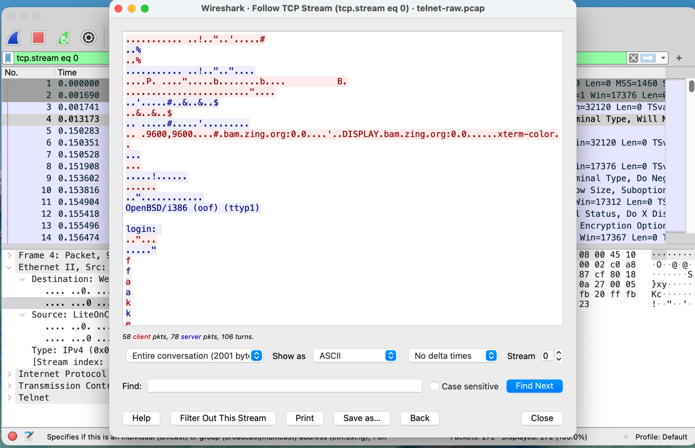
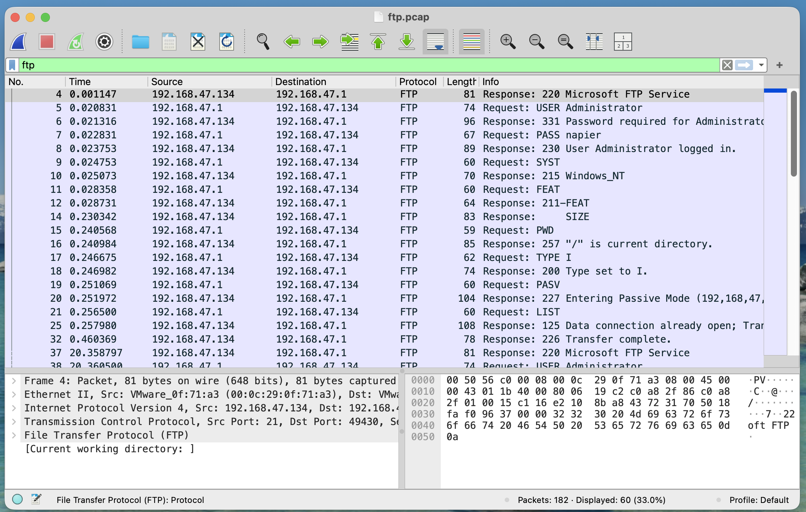
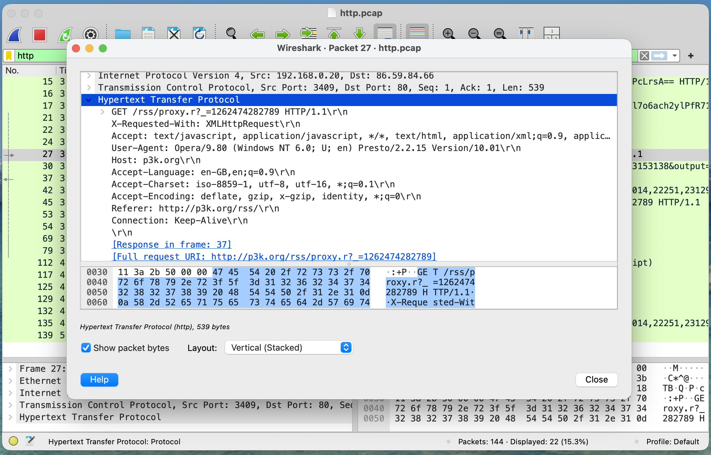
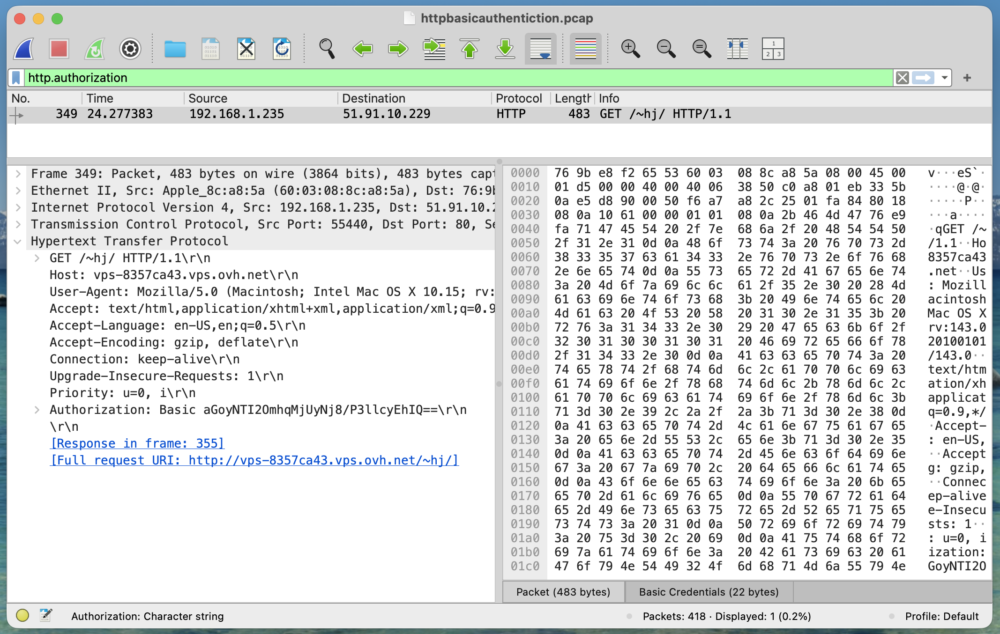
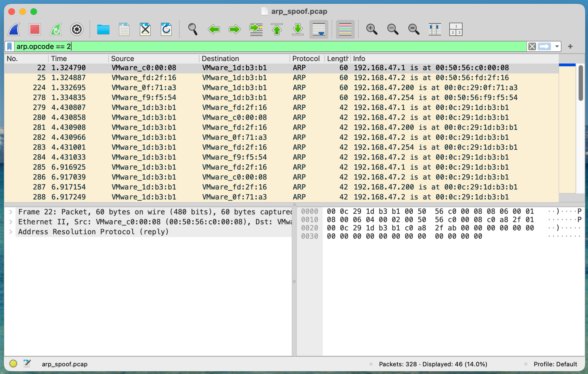

# Lab 1 — Wireshark and Traffic Analysis

## Overview

This lab explores network traffic analysis using Wireshark.
The goal is to inspect packet captures, identify protocols and
communication flows, and analyze security issues in different
network protocols.

## Environment

- Wireshark
- PCAP / PCAPNG captures

## Traffic Analysis

### Telnet


#### Communication

- Client IP: `192.168.0.2`
- Server IP: `192.168.0.1`
- Client port: `1254`
- Server port: `23/TCP`
- Server: `OpenBSD/i386`

#### Analysis

Following the TCP stream reconstructs the Telnet session and exposes
the application data exchanged between the client and server.

The capture reveals authentication information, including the password
`user`. After authentication, the server response and commands exchanged
during the session can also be inspected.

#### Security Observations

The Telnet session does not provide confidentiality for the transmitted
application data. An attacker capable of capturing the network traffic
can inspect sensitive information, including authentication credentials
and commands exchanged during the session.


### FTP

#### Analysis

The FTP communication takes place between:

- **Client:** `192.168.47.1`
- **Server:** `192.168.47.134`
- **Control port:** `21/TCP`
- **Server software:** Microsoft FTP Service

The authentication exchange can be observed directly in the captured traffic:

```text
USER Administrator
331 Password required for Administrator
PASS napier
230 User Administrator logged in.
```

Other FTP commands and responses are also visible in the capture, including
`SYST`, `FEAT`, `PWD`, `TYPE I`, `PASV`, and `LIST`.



#### Security Observations

The FTP control traffic is transmitted in plaintext. The captured traffic
exposes the username (`Administrator`) and password (`napier`), as well as
the commands exchanged between the client and server.

Therefore, an attacker capable of capturing this traffic could obtain the
authentication credentials and inspect the FTP session, resulting in a
loss of confidentiality.


### HTTP

#### Analysis

The HTTP capture contains multiple requests and responses. One of the
observed requests has the following characteristics:

- **Client:** `192.168.0.20`
- **Server:** `86.59.84.66`
- **Client port:** `3409`
- **Server port:** `80/TCP`
- **Method:** `GET`
- **Host:** `p3k.org`
- **Request URI:** `/rss/proxy.r?_=1262474282789`
- **HTTP version:** `HTTP/1.1`

The request headers are directly visible in the captured traffic, including
the `Host`, `User-Agent`, `Accept`, `Accept-Language`, and `Referer` headers.



#### Security Observations

The HTTP communication can be inspected directly from the packet capture.
The requested resource and HTTP headers are visible to an observer of the
network traffic.

Since this communication uses HTTP without encryption, it does not provide
confidentiality for the application data transmitted between the client
and server.


### HTTP Basic Authentication

#### Analysis

The capture contains an HTTP request using Basic Authentication:

- **Client:** `192.168.1.235`
- **Server:** `51.91.10.229`
- **Client port:** `55440`
- **Server port:** `80/TCP`
- **Method:** `GET`
- **Resource:** `/~hj/`
- **Authentication scheme:** HTTP Basic Authentication

The request contains an `Authorization: Basic` header carrying the
authentication credentials encoded in Base64.



#### Security Observations

Base64 encoding does not provide encryption. Therefore, the credentials
contained in the `Authorization` header can be recovered by anyone capable
of capturing the HTTP traffic.

When Basic Authentication is used over unencrypted HTTP, the communication
does not provide confidentiality for the authentication credentials.
Basic Authentication should therefore be protected by an encrypted channel,
such as HTTPS/TLS.


### ARP Spoofing

#### Analysis

The ARP replies reveal inconsistent IP-to-MAC address mappings.

For example, the capture initially shows:

```text
192.168.47.1   is at 00:50:56:c0:00:08
192.168.47.2   is at 00:50:56:fd:2f:16
192.168.47.200 is at 00:0c:29:0f:71:a3
192.168.47.254 is at 00:50:56:f9:f5:54
```

Later, several of these IP addresses are advertised as belonging to the
same MAC address:

```text
192.168.47.1   is at 00:0c:29:1d:b3:b1
192.168.47.2   is at 00:0c:29:1d:b3:b1
192.168.47.200 is at 00:0c:29:1d:b3:b1
192.168.47.254 is at 00:0c:29:1d:b3:b1
```



#### Security Observations

These conflicting IP-to-MAC mappings are evidence of ARP spoofing/poisoning.
The host using MAC address `00:0c:29:1d:b3:b1` is sending ARP replies that
associate its MAC address with IP addresses belonging to other hosts.

This can poison ARP caches and redirect traffic through the attacking host,
potentially enabling a man-in-the-middle attack.


## Conclusions

The packet captures demonstrate several security weaknesses in protocols
that do not provide a secure communication channel.

Telnet and FTP expose sensitive information, including authentication
credentials and commands, while unencrypted HTTP allows requests and
headers to be inspected directly.

HTTP Basic Authentication does not encrypt credentials; it only encodes
them using Base64. Therefore, when used without HTTPS/TLS, authentication
information can be recovered from captured traffic.

The ARP capture also demonstrates how ARP spoofing can create false
IP-to-MAC mappings, potentially allowing an attacker to redirect traffic
and perform a man-in-the-middle attack.

Overall, the analysis highlights the importance of confidentiality,
authentication and integrity mechanisms when communicating over
untrusted networks.